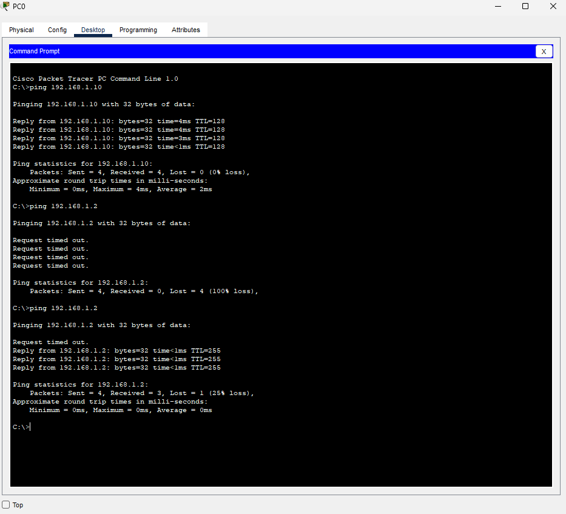
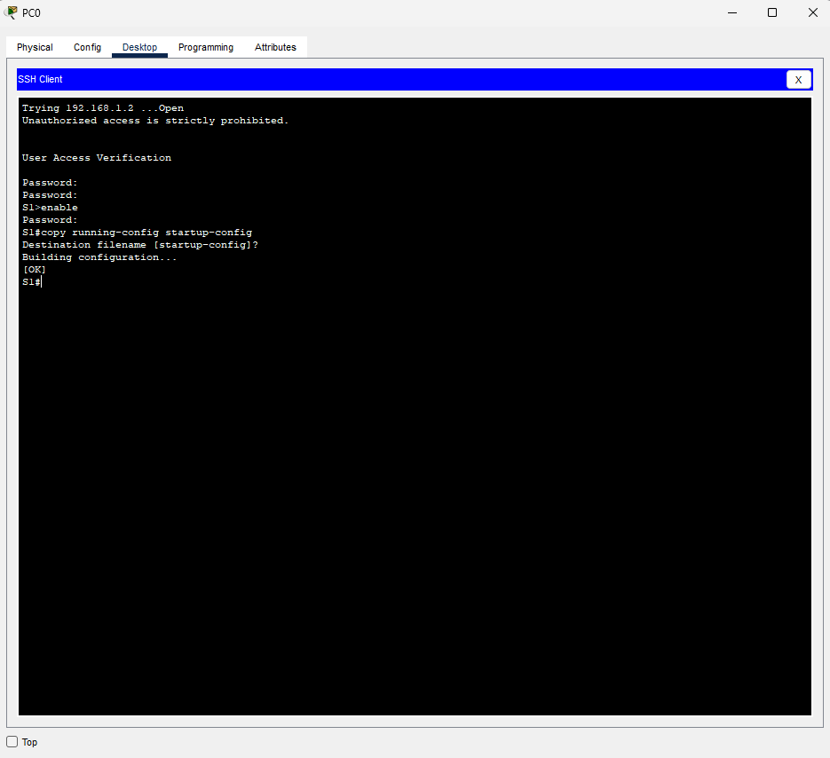

# Базовая настройка коммутатора 

Часть 1. Проверка конфигурации коммутатора по умолчанию
Часть 2. Создание сети и настройка основных параметров устройства
•	Настройте базовые параметры коммутатора.
•	Настройте IP-адрес для ПК.
Часть 3. Проверка сетевых подключений
•	Отобразите конфигурацию устройства.
•	Протестируйте сквозное соединение, отправив эхо-запрос.
•	Протестируйте возможности удаленного управления с помощью Telnet.


## Часть 1 Часть 1. Создание сети и проверка настроек коммутатора по умолчанию
a.	Подсоедините консольный кабель, как показано в топологии. На данном этапе не подключайте кабель Ethernet компьютера PC-A.


b.	Установите консольное подключение к коммутатору с компьютера PC-A с помощью Tera Term или другой программы эмуляции терминала.


Почему нужно использовать консольное подключение для первоначальной настройки коммутатора? Почему нельзя подключиться к коммутатору через Telnet или SSH?
Консольное подключение необходимо для начальной настройки, так как оно обеспечивает физический доступ к устройству (через порт Console) до настройки сетевых параметров. Telnet/SSH требуют наличия IP-адреса, включенных интерфейсов.


## Шаг 2. Проверьте настройки коммутатора по умолчанию.
Press RETURN to get started!


```
Switch>Enable
Switch#show running-config
Building configuration...

Current configuration : 1080 bytes
!
version 15.0
no service timestamps log datetime msec
no service timestamps debug datetime msec
no service password-encryption
!
hostname Switch
!
!
!
!
!
!
spanning-tree mode pvst
spanning-tree extend system-id
!
interface FastEthernet0/1
!
interface FastEthernet0/2
!
interface FastEthernet0/3
!
interface FastEthernet0/4
!
interface FastEthernet0/5
!
interface FastEthernet0/6
!
interface FastEthernet0/7
!
interface FastEthernet0/8
!
interface FastEthernet0/9
!
interface FastEthernet0/10
!
interface FastEthernet0/11
!
interface FastEthernet0/12
!
interface FastEthernet0/13
!
interface FastEthernet0/14
!
interface FastEthernet0/15
!
interface FastEthernet0/16
!
interface FastEthernet0/17
!
interface FastEthernet0/18
!
interface FastEthernet0/19
!
interface FastEthernet0/20
!
interface FastEthernet0/21
!
interface FastEthernet0/22
!
interface FastEthernet0/23
!
interface FastEthernet0/24
!
interface GigabitEthernet0/1
!
interface GigabitEthernet0/2
!
interface Vlan1
 no ip address
 shutdown
!
!
!
!
line con 0
!
line vty 0 4
 login
line vty 5 15
 login
!
!
!
!
end
```

## b.	Изучите текущий файл running configuration.
Вопросы:
Сколько интерфейсов FastEthernet имеется на коммутаторе 2960? 24
Сколько интерфейсов Gigabit Ethernet имеется на коммутаторе 2960? 2
Каков диапазон значений, отображаемых в vty-линиях? 0-15

c.	Изучите файл загрузочной конфигурации (startup configuration), который содержится в энергонезависимом ОЗУ (NVRAM).
```
Switch#show startup-config 
startup-config is not present
```
Почему появляется это сообщение? 
Коммутатор не настроенный, без файла конфигурации.

d.	Изучите характеристики SVI для VLAN 1.
```
show interface vlan 1
```
Данный интерфейс выключен.
IP адрес не назначен
## e.	Изучите IP-свойства интерфейса SVI сети VLAN 1.
```
Switch#show ip interface vlan 1
Vlan1 is administratively down, line protocol is down
  Internet protocol processing disabled
```
## f.	Подсоедините кабель Ethernet компьютера PC-A к порту 6 на коммутаторе и изучите IP-свойства интерфейса SVI сети VLAN 1. Дождитесь согласования параметров скорости и дуплекса между коммутатором и ПК.
```
%LINK-5-CHANGED: Interface FastEthernet0/6, changed state to up

%LINEPROTO-5-UPDOWN: Line protocol on Interface FastEthernet0/6, changed state to up
```
g.	Изучите сведения о версии ОС Cisco IOS на коммутаторе.
```
Switch#show version
```
Под управлением какой версии ОС Cisco IOS работает коммутатор? 
Cisco IOS Software, C2960 Software (C2960-LANBASEK9-M), Version 15.0(2)SE4, RELEASE SOFTWARE (fc1)
Как называется файл образа системы?
flash:c2960-lanbasek9-mz.150-2.SE4.bin

## h.	Изучите свойства по умолчанию интерфейса FastEthernet, который используется компьютером PC-A.
Интерфейс включён.
Нужно выполнить команды в режиме глобальной конфигурации 
```
Switch#configure terminal
Enter configuration commands, one per line.  End with CNTL/Z.
Switch(config)#interface fastethernet 0/6
Switch(config-if)#no shutdown
```
## i.	Изучите флеш-память\

В конце имени файла указано расширение, например .bin. Каталоги не имеют расширения файла.
Вопрос:
Какое имя присвоено образу Cisco IOS?
Имя файла 2960-lanbasek9-mz.150-2.SE4.bin

№ Часть 2. Настройка базовых параметров сетевых устройств

№№ Шаг 1. Настройте базовые параметры коммутатора.

## b.	Назначьте IP-адрес интерфейсу SVI на коммутаторе. Благодаря этому вы получите возможность удаленного управления коммутатором.

```
S1(config)#interface vlan 1
S1(config-if)#ip address 192.168.1.2 255.255.255.0
```
## c.	Доступ через порт консоли также следует ограничить  с помощью пароля
```
S1(config)#line console 0
S1(config-line)#password cisco
S1(config-line)#login
```
## d.	Настройте каналы виртуального соединения для удаленного управления (vty), чтобы коммутатор разрешил доступ через Telnet. Если не настроить пароль VTY, будет невозможно подключиться к коммутатору по протоколу Telnet.

```
S1(config-line)#exit
S1(config)#line vty
% Incomplete command.
S1(config)#line vty ?
  <0-15>  First Line number
S1(config)#line vty 0 4
S1(config-line)#password cisco
S1(config-line)#login
S1(config-line)#
```
Для чего нужна команда login?
Для того, чтобы начал работать пароль.


№ ЧАСТЬ 3
№№ Шаг 2. Протестируйте сквозное соединение, отправив эхо-запрос.
a.	В командной строке компьютера PC-A с помощью утилиты ping проверьте связь сначала с адресом PC-A.
C:\> ping 192.168.1.10 
b.	Из командной строки компьютера PC-A отправьте эхо-запрос на административный адрес интерфейса SVI коммутатора S1.
C:\> ping 192.168.1.2
Если эхо-запрос не удается, найдите и устраните неполадки базовых настроек устройства. Проверьте как физические кабели, так и логическую адресацию.
```

Vlan1                  192.168.1.2     YES manual administratively down down
S1# conf t
Enter configuration commands, one per line.  End with CNTL/Z.
S1(config)#int vlan
% Incomplete command.
S1(config)#int vlan ?
  <1-4094>  Vlan interface number
S1(config)#int vlan 1?
<1-4094>  
S1(config)#int vlan 1
S1(config-if)#no shutdown

S1(config-if)#
%LINK-5-CHANGED: Interface Vlan1, changed state to up

%LINEPROTO-5-UPDOWN: Line protocol on Interface Vlan1, changed state to up

```


## Шаг 3. Проверьте удаленное управление коммутатором S1.



Вопросы для повторения.
1.	Зачем необходимо настраивать пароль VTY для коммутатора? для доступа к коммутатору по SSH/Telnet
2.	Что нужно сделать, чтобы пароли не отправлялись в незашифрованном виде? использовать команду service password-encryption


