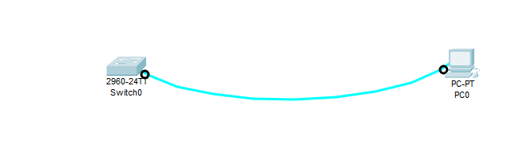
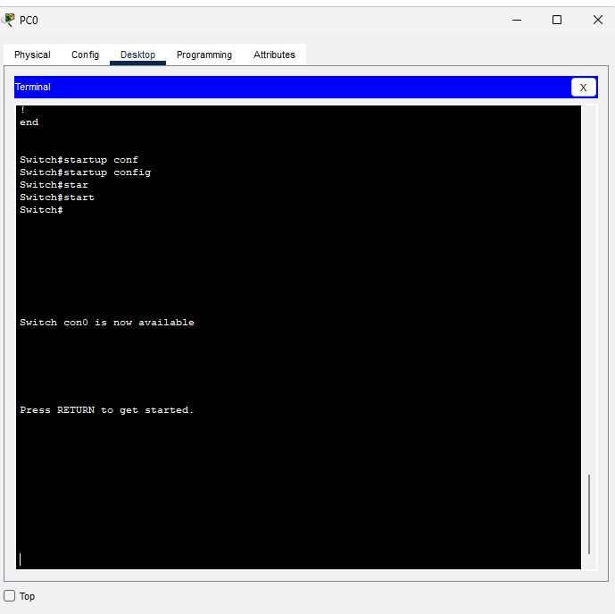

# Базовая настройка коммутатора 

Часть 1. Проверка конфигурации коммутатора по умолчанию
Часть 2. Создание сети и настройка основных параметров устройства
•	Настройте базовые параметры коммутатора.
•	Настройте IP-адрес для ПК.
Часть 3. Проверка сетевых подключений
•	Отобразите конфигурацию устройства.
•	Протестируйте сквозное соединение, отправив эхо-запрос.
•	Протестируйте возможности удаленного управления с помощью Telnet.


## Часть 1 Часть 1. Создание сети и проверка настроек коммутатора по умолчанию
a.	Подсоедините консольный кабель, как показано в топологии. На данном этапе не подключайте кабель Ethernet компьютера PC-A.


b.	Установите консольное подключение к коммутатору с компьютера PC-A с помощью Tera Term или другой программы эмуляции терминала.



Почему нужно использовать консольное подключение для первоначальной настройки коммутатора? Почему нельзя подключиться к коммутатору через Telnet или SSH?
Консольное подключение необходимо для начальной настройки, так как оно обеспечивает физический доступ к устройству (через порт Console) до настройки сетевых параметров. Telnet/SSH требуют наличия IP-адреса, включенных интерфейсов.


## Шаг 2. Проверьте настройки коммутатора по умолчанию.
Press RETURN to get started!


Switch>Enable
Switch#show running-config
Building configuration...

Current configuration : 1080 bytes
!
version 15.0
no service timestamps log datetime msec
no service timestamps debug datetime msec
no service password-encryption
!
hostname Switch
!
!
!
!
!
!
spanning-tree mode pvst
spanning-tree extend system-id
!
interface FastEthernet0/1
!
interface FastEthernet0/2
!
interface FastEthernet0/3
!
interface FastEthernet0/4
!
interface FastEthernet0/5
!
interface FastEthernet0/6
!
interface FastEthernet0/7
!
interface FastEthernet0/8
!
interface FastEthernet0/9
!
interface FastEthernet0/10
!
interface FastEthernet0/11
!
interface FastEthernet0/12
!
interface FastEthernet0/13
!
interface FastEthernet0/14
!
interface FastEthernet0/15
!
interface FastEthernet0/16
!
interface FastEthernet0/17
!
interface FastEthernet0/18
!
interface FastEthernet0/19
!
interface FastEthernet0/20
!
interface FastEthernet0/21
!
interface FastEthernet0/22
!
interface FastEthernet0/23
!
interface FastEthernet0/24
!
interface GigabitEthernet0/1
!
interface GigabitEthernet0/2
!
interface Vlan1
 no ip address
 shutdown
!
!
!
!
line con 0
!
line vty 0 4
 login
line vty 5 15
 login
!
!
!
!
end

## b.	Изучите текущий файл running configuration.
Вопросы:
Сколько интерфейсов FastEthernet имеется на коммутаторе 2960? 24
Сколько интерфейсов Gigabit Ethernet имеется на коммутаторе 2960? 2
Каков диапазон значений, отображаемых в vty-линиях? 0-15

c.	Изучите файл загрузочной конфигурации (startup configuration), который содержится в энергонезависимом ОЗУ (NVRAM).
```
Switch#show startup-config 
startup-config is not present
```
Почему появляется это сообщение? 
Коммутатор не настроенный, без файла конфигурации.

d.	Изучите характеристики SVI для VLAN 1.
```
show interface vlan 1
```
Данный интерфейс выключен.


