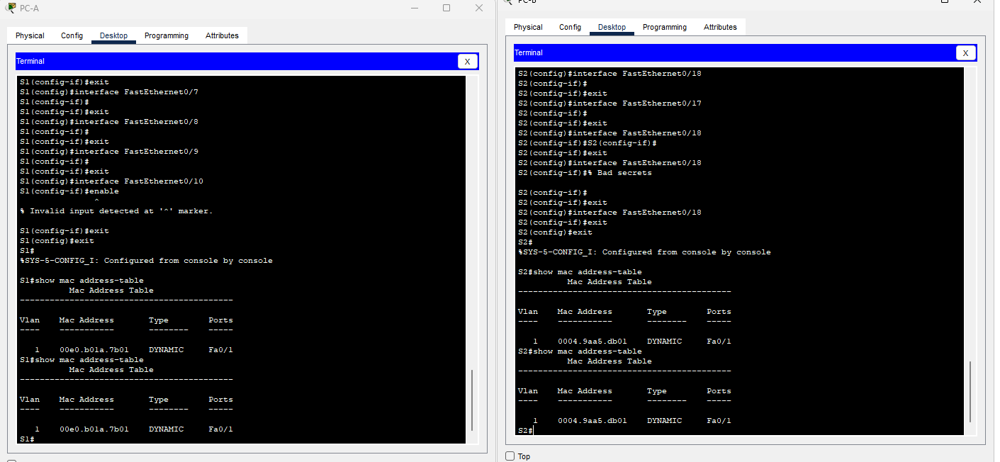
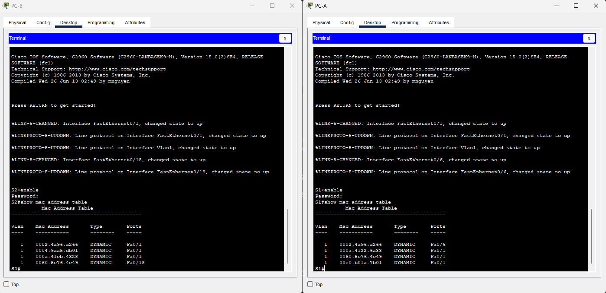

# Лабораторная работа. Просмотр таблицы MAC-адресов коммутатора 


# Часть 1. Создание и настройка сети

##Шаг 1. Подключите сеть в соответствии с топологией.


##Шаг 3. Выполните инициализацию и перезагрузку коммутаторов.
```
'''S1#erase startup-config 
Erasing the nvram filesystem will remove all configuration files! Continue? [confirm]
[OK]
Erase of nvram: complete
%SYS-7-NV_BLOCK_INIT: Initialized the geometry of nvram
S1#reload
System configuration has been modified. Save? [yes/no]:no
Proceed with reload? [confirm]
C2960 Boot Loader (C2960-HBOOT-M) Version 12.2(25r)FX, RELEASE SOFTWARE (fc4)
Cisco WS-C2960-24TT (RC32300) processor (revision C0) with 21039K bytes of memory.
2960-24TT starting...
```
##Шаг 4. Настройте базовые параметры каждого коммутатора.
S1
```
Switch>enable
switch#configure terminal 
Enter configuration commands, one per line.  End with CNTL/Z.
Switch(config)#hostname S1
S1(config)#int v 1
S1(config-if)#ip address 192.168.1.11 255.255.255.0
S1(config-if)#no shutdown

S1(config-if)#
%LINK-5-CHANGED: Interface Vlan1, changed state to up
S1(config)#line vty 0 15
S1(config-line)#password cisco
S1(config-line)#login
S1(config)#enable secret class
S1(config)#
```
S2
```
Switch>enable
Switch#conf
Switch#configure term
Switch#configure terminal 
Enter configuration commands, one per line.  End with CNTL/Z.
Switch(config)#hostname S2
S2(config)#int v 1
S2(config-if)#ip addr
S2(config-if)#ip address 192.168.1.12 255.255.255.0
S2(config-if)#
S2(config-if)#no shutdown
S2(config-if)#
%LINK-5-CHANGED: Interface Vlan1, changed state to up
S2(config)#line vty 0 15
S2(config-line)#password cisco
S2(config-line)#login
S2(config)#enable secret class
S2(config)#
```
#Часть 2. Изучение таблицы МАС-адресов коммутатора
##Шаг 1. Запишите МАС-адреса сетевых устройств.
a.	Откройте командную строку на PC-A и PC-B и введите команду ipconfig /all.
Открытие окна командной строки Windows
Вопрос:
Назовите физические адреса адаптера Ethernet.
MAC-адрес компьютера PC-A:0002.4A96.A266
MAC-адрес компьютера PC-B:0060.5C76.4C49

b.	Подключитесь к коммутаторам S1 и S2 через консоль и введите команду show interface F0/1 на каждом коммутаторе.
Откройте окно конфигурации
Вопросы:
Назовите адреса оборудования во второй строке выходных данных команды (или зашитый адрес — bia).
МАС-адрес коммутатора S1 Fast Ethernet 0/1: 0004.9aa5.db01 
МАС-адрес коммутатора S2 Fast Ethernet 0/1: 00e0.b01a.7b01


##Шаг 2. Просмотрите таблицу МАС-адресов коммутатора.



Записаны MAC-адреса самих коммутаторов.



