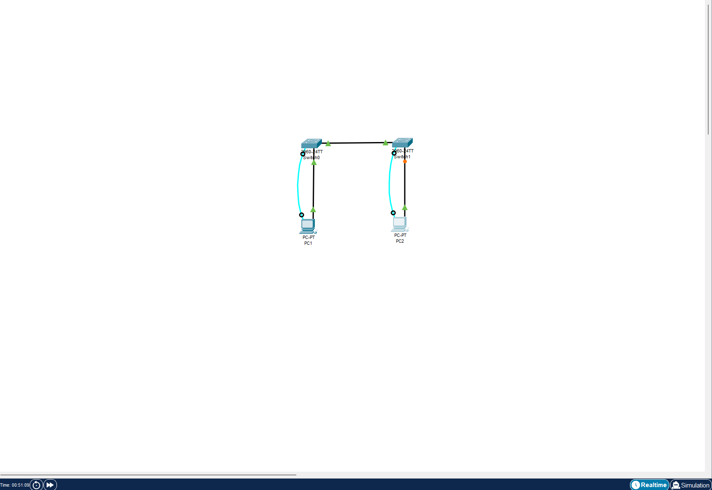

№ Лабораторная работа. Просмотр таблицы MAC-адресов коммутатора 

№№ Часть 1. Создание и настройка сети

#Шаг 1. Подключите сеть в соответствии с топологией.

'''
'''S1#erase startup-config 
Erasing the nvram filesystem will remove all configuration files! Continue? [confirm]
[OK]
Erase of nvram: complete
%SYS-7-NV_BLOCK_INIT: Initialized the geometry of nvram
S1#reload
System configuration has been modified. Save? [yes/no]:no
Proceed with reload? [confirm]
C2960 Boot Loader (C2960-HBOOT-M) Version 12.2(25r)FX, RELEASE SOFTWARE (fc4)
Cisco WS-C2960-24TT (RC32300) processor (revision C0) with 21039K bytes of memory.
2960-24TT starting...
'''
