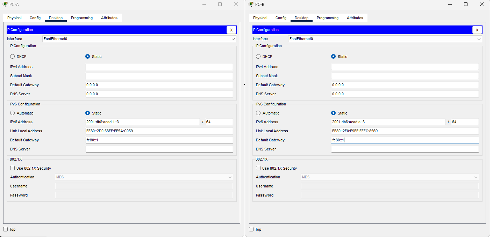

# Лабораторная работа. Настройка IPv6-адресов на сетевых устройствах

##Часть 1. Настройка топологии и конфигурация основных параметров маршрутизатора и коммутатора
###Шаг 2. Настройте коммутатор.
```
Switch>enable
Switch#conf t
Enter configuration commands, one per line.  End with CNTL/Z.
Switch(config)#hostname S1
S1(config)#line vty 0 4
S1(config-line)#password cisco
S1(config-line)#login
S1(config)#line cons 0
S1(config-line)#password cisco
S1(config-line)#login
S1(config)#enable secret class
S1(config-line)#
S1(config-line)#exit
S1(config-if)#sdm prefer dual-ipv4-and-ipv6 default
Changes to the running SDM preferences have been stored, but cannot take effect until the next reload.
Use 'show sdm prefer' to see what SDM preference is currently active.
S1(config)#end
S1#
%SYS-5-CONFIG_I: Configured from console by console

 S1#reload
S1(config)#interface v1
S1(config)#ipv6 unicast-routing 
S1(config)#interf v 1
S1(config-if)#ipv6 address 2001:db8:acad:1::b/64
S1(config-if)#ipv6 address fe80::B link-local
S1(config-if)#no shutdown
 ```
###Шаг 1. Настройте маршрутизатор.

```
Router(config)#hostname R1
R1(config)#line vty 0 4
R1(config-line)#password cisco
R1(config-line)#login
R1(config-line)#line cons 0
R1(config-line)#exit
R1(config)#line cons 0
R1(config-line)#password cisco
R1(config-line)#login
R1(config-line)#exit
R1(config)#enable secret class
R1(config)#
```

##Часть 2. Ручная настройка IPv6-адресов

###Шаг 1. Назначьте IPv6-адреса интерфейсам Ethernet на R1

####a)
```
R1(config)#interface g
R1(config)#interface gigabitEthernet 0/0
R1(config-if)#ipv6
R1(config-if)#ipv6 ad
R1(config-if)#ipv6 address 2001:db8:acad:a::1
% Incomplete command.
R1(config-if)#ipv6 address 2001:db8:acad:a::1/64
R1(config-if)#ipv6 address fe80::1/64
%GigabitEthernet0/0: Error: FE80::1/64 is invalid
R1(config-if)#ipv6 address fe80::1
% Incomplete command.
R1(config-if)#exit
R1(config)#interf
R1(config)#interface g
R1(config)#interface gigabitEthernet 0/1
R1(config-if)#ipv6 address 2001:db8:acad:1::1/64
R1(config-if)#ipv6 address fe80::1
% Incomplete command.
R1(config-if)#exit
R1(config)#exit
R1#
%SYS-5-CONFIG_I: Configured from console by console
```
###b)

```
R1(config)#interface gigabitEthernet 0/0
R1(config-if)#no shutdown

R1(config-if)#
%LINK-5-CHANGED: Interface GigabitEthernet0/0, changed state to up

%LINEPROTO-5-UPDOWN: Line protocol on Interface GigabitEthernet0/0, changed state to up

R1(config-if)#exit
R1(config)#interface gigabitEthernet 0/1
R1(config-if)#no shutdown

R1(config-if)#
%LINK-5-CHANGED: Interface GigabitEthernet0/1, changed state to up

%LINEPROTO-5-UPDOWN: Line protocol on Interface GigabitEthernet0/1, changed state to up

%SYS-5-CONFIG_I: Configured from console by console

R1#show ipv6
R1#show ipv6 int br
GigabitEthernet0/0         [up/up]
    FE80::260:47FF:FE79:3A01
    2001:DB8:ACAD:A::1
GigabitEthernet0/1         [up/up]
    FE80::260:47FF:FE79:3A02
    2001:DB8:ACAD:1::1
GigabitEthernet0/2         [administratively down/down]
    unassigned
Vlan1                      [administratively down/down]
    unassigned
R1#
```
###c;d)
```
R1(config)#interface g
R1(config)#interface gigabitEthernet 0/0
link-local  Use link-local address
R1(config-if)#ipv6 address fe80::1 link-local
R1(config)#interface gigabitEthernet 0/1
R1(config-if)#ipv6 add
R1(config-if)#ipv6 address fe80::1 link-local
R1(config-if)#exit
R1(config)#exit
R1#
%SYS-5-CONFIG_I: Configured from console by console
R1#show ipv6 interface br
GigabitEthernet0/0         [up/up]
    FE80::1
    2001:DB8:ACAD:A::1
GigabitEthernet0/1         [up/up]
    FE80::1
    2001:DB8:ACAD:1::1
GigabitEthernet0/2         [administratively down/down]
    unassigned
Vlan1                      [administratively down/down]
    unassigned
R1#
```

###Шаг 2. Активируйте IPv6-маршрутизацию на R1.

a)
```
C:\>ipconfig

FastEthernet0 Connection:(default port)

   Connection-specific DNS Suffix..: 
   Link-local IPv6 Address.........: FE80::2E0:F9FF:FEEC:8569
   IPv6 Address....................: ::
   IPv4 Address....................: 0.0.0.0
   Subnet Mask.....................: 0.0.0.0
   Default Gateway.................: ::
                                     0.0.0.0
```

b)
```
R1#conf t
Enter configuration commands, one per line.  End with CNTL/Z.
R1(config)#ipv6 unicast-r
R1(config)#ipv6 unicast-routing
```
c)
```
C:\>ipconfig

FastEthernet0 Connection:(default port)

   Connection-specific DNS Suffix..: 
   Link-local IPv6 Address.........: FE80::2E0:F9FF:FEEC:8569
   IPv6 Address....................: 2001:DB8:ACAD:A:2E0:F9FF:FEEC:8569
   IPv4 Address....................: 0.0.0.0
   Subnet Mask.....................: 0.0.0.0
   Default Gateway.................: FE80::1
                                     0.0.0.0
```

###Шаг 3. Назначьте IPv6-адреса интерфейсу управления (SVI) на S1.
a)
```
S1(config)#interface v1
S1(config)#ipv6 unicast-routing 
S1(config)#interf v 1
S1(config-if)#ipv6 address 2001:db8:acad:1::b/64
S1(config-if)#ipv6 address fe80::B link-local
S1(config-if)#no shutdown
```
b)
```
S1#show ipv6 interface vlan 1
Vlan1 is up, line protocol is up
  IPv6 is enabled, link-local address is FE80::B
  No Virtual link-local address(es):
  Global unicast address(es):
    2001:DB8:ACAD:1::B, subnet is 2001:DB8:ACAD:1::/64
  Joined group address(es):
    FF02::1
    FF02::1:FF00:B
  MTU is 1500 bytes
  ICMP error messages limited to one every 100 milliseconds
  ICMP redirects are enabled
  ICMP unreachables are sent
  Output features: Check hwidb
  ND DAD is enabled, number of DAD attempts: 1
  ND reachable time is 30000 milliseconds
  ND advertised reachable time is 0 (unspecified)
  ND advertised retransmit interval is 0 (unspecified)
  ND router advertisements are sent every 200 seconds
  ND router advertisements live for 1800 seconds
  ND advertised default router preference is Medium
  Hosts use stateless autoconfig for addresses.
```

###Шаг 4. Назначьте компьютерам статические IPv6-адреса.


