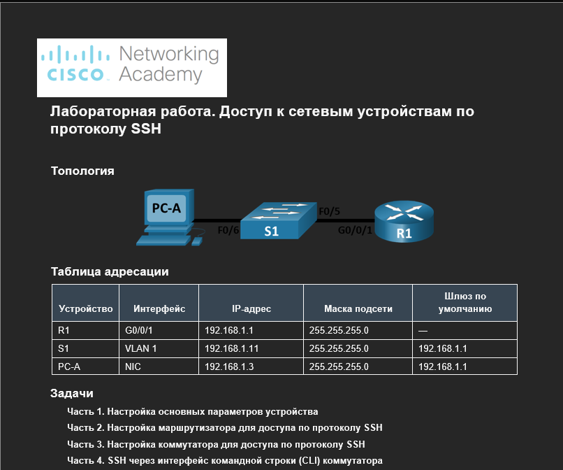
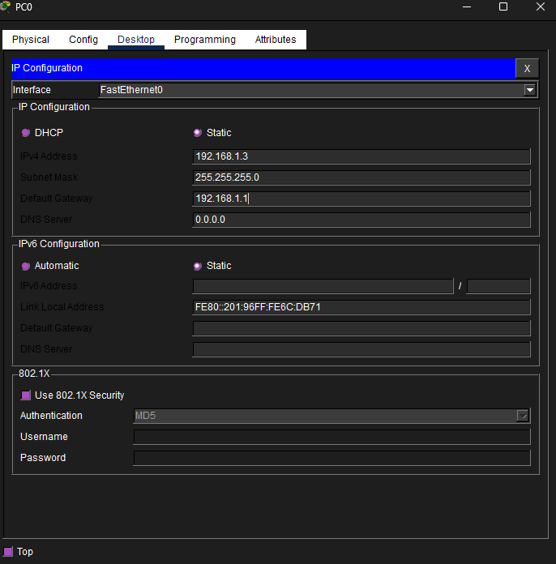
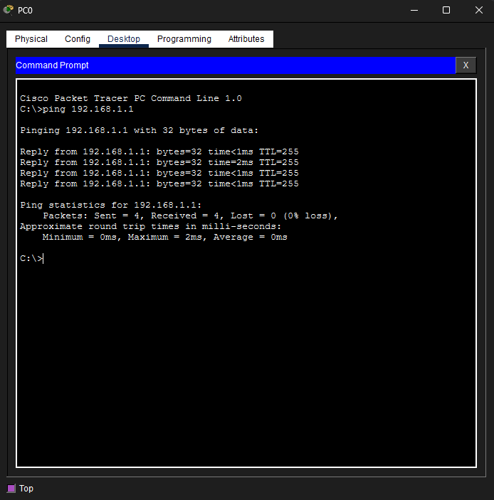
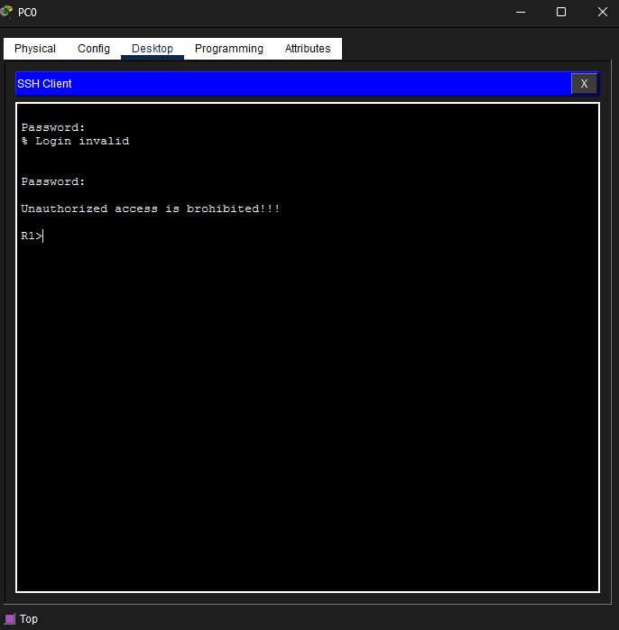
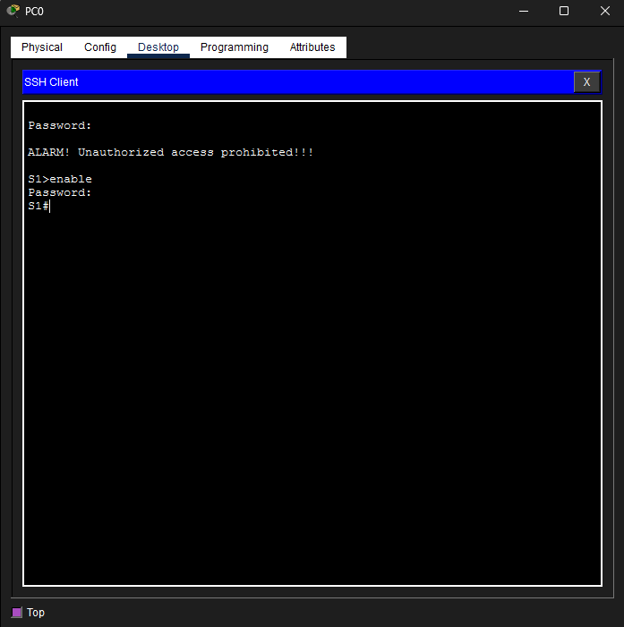

#Лабораторная работа. Доступ к сетевым устройствам по протоколу SSH


##Часть 1. Настройка основных параметров устройств

Шаг 1. Создайте сеть согласно топологии.


Шаг 2. Выполните инициализацию и перезагрузку маршрутизатора и коммутатора.
коммутатор
```
S1#erase start
S1#erase startup-config 
Erasing the nvram filesystem will remove all configuration files! Continue? [confirm]
[OK]
Erase of nvram: complete
%SYS-7-NV_BLOCK_INIT: Initialized the geometry of nvram
S1#reload
System configuration has been modified. Save? [yes/no]:yes
Building configuration...
[OK]
Proceed with reload? [confirm]
C2960 Boot Loader (C2960-HBOOT-M) Version 12.2(25r)FX, RELEASE SOFTWARE (fc4)
Cisco WS-C2960-24TT (RC32300) processor (revision C0) with 21039K bytes of memory.
2960-24TT starting...
```
Маршрутизатор 

```

Router>enable
Router#erase start
Router#erase startup-config 
Erasing the nvram filesystem will remove all configuration files! Continue? [confirm]
[OK]
Erase of nvram: complete
%SYS-7-NV_BLOCK_INIT: Initialized the geometry of nvram
Router#reload
Proceed with reload? [confirm]
Initializing Hardware ...
```

##Шаг 3. Настройте маршрутизатор.

a.	Подключитесь к маршрутизатору с помощью консоли и активируйте привилегированный режим EXEC.
b.	Войдите в режим конфигурации.
c.	Отключите поиск DNS, чтобы предотвратить попытки маршрутизатора неверно преобразовывать введенные команды таким образом, как будто они являются именами узлов.
d.	Назначьте class в качестве зашифрованного пароля привилегированного режима EXEC.
e.	Назначьте cisco в качестве пароля консоли и включите вход в систему по паролю.
f.	Назначьте cisco в качестве пароля VTY и включите вход в систему по паролю.
g.	Зашифруйте открытые пароли.
h.	Создайте баннер, который предупреждает о запрете несанкционированного доступа.
i.	Настройте и активируйте на маршрутизаторе интерфейс G0/0/1, используя информацию, приведенную в таблице адресации.
j.	Сохраните текущую конфигурацию в файл загрузочной конфигурации.


```
R1#conf t
Enter configuration commands, one per line.  End with CNTL/Z.
R1(config)#no ip domain-look
R1(config)#no ip domain-lookup 
R1(config)#enable secret class
R1(config)#line console 0
R1(config-line)#password cisco
R1(config-line)#login
R1(config-line)#line vt
R1(config-line)#exit
R1(config)#line vt
R1(config)#line vty 0 4
R1(config-line)#password cisco
R1(config-line)#login
R1(config-line)#exit
R1(config)#service password-encry
R1(config)#banner motd #Unauthorized access is brohibited!!!#
R1(config)#interf
R1(config)#interface g0/0/1
R1(config-if)#ip address 192.168.1.1 255.255.255.0
R1(config-if)#no shut

R1(config-if)#
%LINK-5-CHANGED: Interface GigabitEthernet0/0/1, changed state to up

%LINEPROTO-5-UPDOWN: Line protocol on Interface GigabitEthernet0/0/1, changed state to up
```
##Шаг 4. Настройте компьютер PC-A.
a.	Настройте для PC-A IP-адрес и маску подсети.
b.	Настройте для PC-A шлюз по умолчанию.



##Шаг 5. Проверьте подключение к сети.
Пошлите с PC-A команду Ping на маршрутизатор R1. Если эхо-запрос с помощью команды ping не проходит, найдите и устраните неполадки подключения.



#Часть 2. Настройка маршрутизатора для доступа по протоколу SSH

№№Шаг 1. Настройте аутентификацию устройств.

a.	Задайте имя устройства.
b.	Задайте домен для устройства.
```
R1#conf t
Enter configuration commands, one per line.  End with CNTL/Z.
R1(config)#ip dom
R1(config)#ip domain
R1(config)#ip domain-na
R1(config)#ip domain-name cisco.com
R1(config)#hostname R1
```
##Шаг 2. Создайте ключ шифрования с указанием его длины.
```
R1(config)#crypt
R1(config)#crypto key gen
R1(config)#crypto key generate rsa
The name for the keys will be: R1.cisco.com
```
##Шаг 3. Создайте имя пользователя в локальной базе учетных записей.
```
R1(config)#username admin secret Adm1nP@55
R1(config)#
```
##Шаг 4. Активируйте протокол SSH на линиях VTY.

a.	Активируйте протоколы Telnet и SSH на входящих линиях VTY с помощью команды transport input.
b.	Измените способ входа в систему таким образом, чтобы использовалась проверка пользователей по локальной базе учетных записей.
```
R1(config-line)#transport input ?
  all     All protocols
  none    No protocols
  ssh     TCP/IP SSH protocol
  telnet  TCP/IP Telnet protocol
R1(config-line)#transport input ss
R1(config-line)#transport input ssh/tel
R1(config-line)#transport input ssh tel
R1(config-line)#transport input all
R1(config-line)#login local
R1(config-line)#ip ssh vers 2
R1(config)#sho
R1(config)#do show ip ssh
SSH Enabled - version 2.0
```
##Шаг 5. Сохраните текущую конфигурацию в файл загрузочной конфигурации.

##Шаг 5. Сохраните текущую конфигурацию в файл загрузочной конфигурации.
```
R1#copy running
R1#copy running-config start
R1#copy running-config startup-config 
Destination filename [startup-config]? 
Building configuration...
[OK]
```

##Шаг 6. Установите соединение с маршрутизатором по протоколу SSH.

a.	Запустите Tera Term с PC-A.
b.	Установите SSH-подключение к R1. Use the username admin and password Adm1nP@55. У вас должно получиться установить SSH-подключение к R1.



№Часть 3. Настройка коммутатора для доступа по протоколу SSH

Шаг 1. Настройте основные параметры коммутатора.
a.	Подключитесь к коммутатору с помощью консольного подключения и активируйте привилегированный режим EXEC.
b.	Войдите в режим конфигурации.
c.	Отключите поиск DNS, чтобы предотвратить попытки маршрутизатора неверно преобразовывать введенные команды таким образом, как будто они являются именами узлов.
d.	Назначьте class в качестве зашифрованного пароля привилегированного режима EXEC.
e.	Назначьте cisco в качестве пароля консоли и включите вход в систему по паролю.
f.	Назначьте cisco в качестве пароля VTY и включите вход в систему по паролю.
g.	Зашифруйте открытые пароли.
h.	Создайте баннер, который предупреждает о запрете несанкционированного доступа.
i.	Настройте и активируйте на коммутаторе интерфейс VLAN 1, используя информацию, приведенную в таблице адресации.
j.	Сохраните текущую конфигурацию в файл загрузочной конфигурации.

```
S1>enable
S1#conf t
Enter configuration commands, one per line.  End with CNTL/Z.
S1(config)#no ip domain-lookup
S1(config)#enable secret class
S1(config)#line cons
S1(config)#line console 0
S1(config-line)#passworrd cisco
S1(config-line)#password cisco
S1(config-line)#login
S1(config-line)#exit
S1(config)#
S1(config)#line vty 0 4
S1(config-line)#password cisco
S1(config-line)#login
S1(config-line)#exit
S1(config)#service password encr
S1(config)#service password encrypt
S1(config)#exit
S1(config)#service password
S1(config)#service password-encryption 
S1(config)#banner motd #ALARM!
S1(config)#banner motd #ALARM! Unauthorized access prohibited!!!#
S1(config)#interface vlan 1
S1(config-if)#ip add
S1(config-if)#ip address 192.168.1.11 255.255.255.0
S1(config-if)#no shutdown

S1(config-if)#
%LINK-3-UPDOWN: Interface Vlan1, changed state to down

%LINEPROTO-5-UPDOWN: Line protocol on Interface Vlan1, changed state to up

S1(config-if)#exit
S1(config)#exit
S1#copy startup-config running-config
Destination filename [running-config]? 

1076 bytes copied in 0.416 secs (2586 bytes/sec)
S1#
%LINK-5-CHANGED: Interface Vlan1, changed state to administratively down

%LINEPROTO-5-UPDOWN: Line protocol on Interface Vlan1, changed state to down

%SYS-5-CONFIG_I: Configured from console by console

```
##Шаг 2. Настройте коммутатор для соединения по протоколу SSH.
a.	Настройте имя устройства, как указано в таблице адресации.
b.	Задайте домен для устройства.
c.	Создайте ключ шифрования с указанием его длины.
d.	Создайте имя пользователя в локальной базе учетных записей.
e.	Активируйте протоколы Telnet и SSH на линиях VTY.
f.	Измените способ входа в систему таким образом, чтобы использовалась проверка пользователей по локальной базе учетных записей.

```
S1#conf t
Enter configuration commands, one per line.  End with CNTL/Z.
S1(config)#ip domain
S1(config)#ip domain-n
S1(config)#ip domain-name cisco2960.com
S1(config)#crypto key
S1(config)#crypto key gen
S1(config)#crypto key generate rsa
The name for the keys will be: S1.cisco2960.com
Choose the size of the key modulus in the range of 360 to 4096 for your
  General Purpose Keys. Choosing a key modulus greater than 512 may take
  a few minutes.

How many bits in the modulus [512]: 1024
% Generating 1024 bit RSA keys, keys will be non-exportable...[OK]

S1(config)#username admin secret Adm1nP@55
*Mar 1 8:15:32.280: %SSH-5-ENABLED: SSH 1.99 has been enabled
S1(config)#transpor
S1(config)#lyne vt
S1(config)#line vty 0 4
S1(config-line)#transpor
S1(config-line)#transport inp
S1(config-line)#transport input all
S1(config-line)#version 2
S1(config-line)#ip ssh version 2
S1(config)#login local
S1(config)#line vty
% Incomplete command.
S1(config)#line vty 0 4
S1(config-line)#login local
S1(config-line)#
```
##Шаг 3. Установите соединение с коммутатором по протоколу SSH.


#Часть 4. Настройка протокола SSH с использованием интерфейса командной строки (CLI) коммутатора

