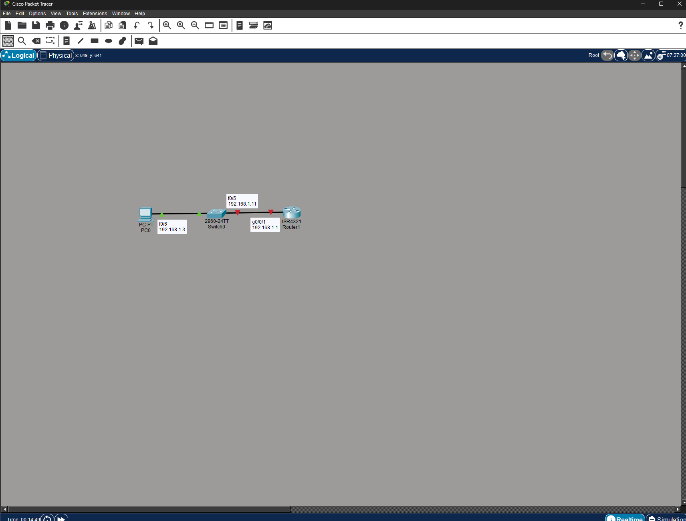

#Лабораторная работа. Доступ к сетевым устройствам по протоколу SSH


##Часть 1. Настройка основных параметров устройств

Шаг 1. Создайте сеть согласно топологии.



Шаг 2. Выполните инициализацию и перезагрузку маршрутизатора и коммутатора.
коммутатор
```
S1#erase start
S1#erase startup-config 
Erasing the nvram filesystem will remove all configuration files! Continue? [confirm]
[OK]
Erase of nvram: complete
%SYS-7-NV_BLOCK_INIT: Initialized the geometry of nvram
S1#reload
System configuration has been modified. Save? [yes/no]:yes
Building configuration...
[OK]
Proceed with reload? [confirm]
C2960 Boot Loader (C2960-HBOOT-M) Version 12.2(25r)FX, RELEASE SOFTWARE (fc4)
Cisco WS-C2960-24TT (RC32300) processor (revision C0) with 21039K bytes of memory.
2960-24TT starting...
```
Маршрутизатор 

```

Router>enable
Router#erase start
Router#erase startup-config 
Erasing the nvram filesystem will remove all configuration files! Continue? [confirm]
[OK]
Erase of nvram: complete
%SYS-7-NV_BLOCK_INIT: Initialized the geometry of nvram
Router#reload
Proceed with reload? [confirm]
Initializing Hardware ...
```

Шаг 3. Настройте маршрутизатор.

a.	Подключитесь к маршрутизатору с помощью консоли и активируйте привилегированный режим EXEC.
b.	Войдите в режим конфигурации.
c.	Отключите поиск DNS, чтобы предотвратить попытки маршрутизатора неверно преобразовывать введенные команды таким образом, как будто они являются именами узлов.
d.	Назначьте class в качестве зашифрованного пароля привилегированного режима EXEC.
e.	Назначьте cisco в качестве пароля консоли и включите вход в систему по паролю.
f.	Назначьте cisco в качестве пароля VTY и включите вход в систему по паролю.
g.	Зашифруйте открытые пароли.
h.	Создайте баннер, который предупреждает о запрете несанкционированного доступа.
i.	Настройте и активируйте на маршрутизаторе интерфейс G0/0/1, используя информацию, приведенную в таблице адресации.
j.	Сохраните текущую конфигурацию в файл загрузочной конфигурации.


```
R1#conf t
Enter configuration commands, one per line.  End with CNTL/Z.
R1(config)#no ip domain-look
R1(config)#no ip domain-lookup 
R1(config)#enable secret class
R1(config)#line console 0
R1(config-line)#password cisco
R1(config-line)#login
R1(config-line)#line vt
R1(config-line)#exit
R1(config)#line vt
R1(config)#line vty 0 4
R1(config-line)#password cisco
R1(config-line)#login
R1(config-line)#exit
R1(config)#service password-encry
R1(config)#banner motd #Unauthorized access is brohibited!!!#
R1(config)#interf
R1(config)#interface g0/0/1
R1(config-if)#ip address 192.168.1.1 255.255.255.0
R1(config-if)#no shut

R1(config-if)#
%LINK-5-CHANGED: Interface GigabitEthernet0/0/1, changed state to up

%LINEPROTO-5-UPDOWN: Line protocol on Interface GigabitEthernet0/0/1, changed state to up
```


