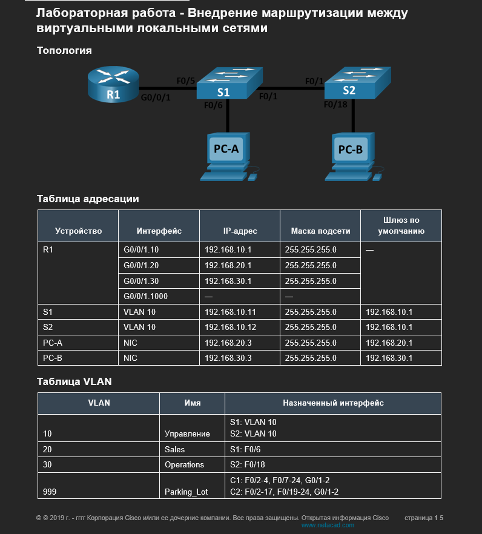
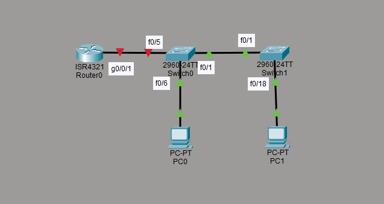
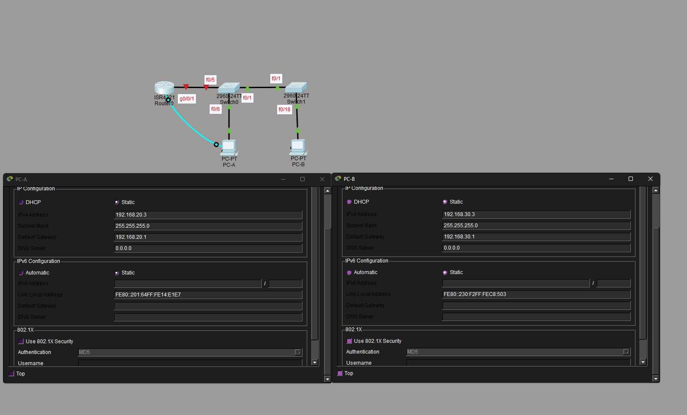

#Лабораторная работа - Внедрение маршрутизации между виртуальными локальными сетями 

#Часть 1. Создание сети и настройка основных параметров устройства

№№ Шаг 1. Создайте сеть согласно топологии.






##Шаг 1. Создайте сеть согласно топологии.

a.	Подключитесь к маршрутизатору с помощью консоли и активируйте привилегированный режим EXEC.
Откройте окно конфигурации
b.	Войдите в режим конфигурации.
c.	Назначьте маршрутизатору имя устройства.
d.	Отключите поиск DNS, чтобы предотвратить попытки маршрутизатора неверно преобразовывать введенные команды таким образом, как будто они являются именами узлов.
e.	Назначьте class в качестве зашифрованного пароля привилегированного режима EXEC.
f.	Назначьте cisco в качестве пароля консоли и включите вход в систему по паролю.
g.	Установите cisco в качестве пароля виртуального терминала и активируйте вход.
h.	Зашифруйте открытые пароли.
i.	Создайте баннер с предупреждением о запрете несанкционированного доступа к устройству.
j.	Сохраните текущую конфигурацию в файл загрузочной конфигурации.
k.	Настройте на маршрутизаторе время.


```
Router>en
Router#conf t
Router(config)#hostname R1
R1(config)#no ip domain-loo
R1(config)#no ip domain-lookup 
R1(config)#enable secret class
R1(config)#line cons 0
R1(config-line)#password cisco
R1(config-line)#login
R1(config-line)#exit
R1(config)#line vty 0 4
R1(config-line)#password cisco
R1(config-line)#login
R1(config-line)#exit
R1(config)#service password-en
R1(config)#service password-encryption 
R1(config)#banner motd #Attention! Unauthorized access prohibited! #
R1(config)#
R1#copy run
R1#copy running-config start
R1#copy running-config startup-config 
Destination filename [startup-config]? 
Building configuration...
[OK]
R1#clock ?
  set  Set the time and date
R1#clock set 16:24:00 
R1#clock set 16:24:00 ?
  <1-31>  Day of the month
  MONTH   Month of the year
R1#clock set 16:24:00 Jun 21 2026
R1#show clo
R1#show clock 
16:24:6.963 UTC Sun Jun 21 2026
```
##Шаг 3. Настройте базовые параметры каждого коммутатора.

a.	Присвойте коммутатору имя устройства.
b.	Отключите поиск DNS, чтобы предотвратить попытки маршрутизатора неверно преобразовывать введенные команды таким образом, как будто они являются именами узлов.
c.	Назначьте class в качестве зашифрованного пароля привилегированного режима EXEC.
d.	Назначьте cisco в качестве пароля консоли и включите вход в систему по паролю.
e.	Установите cisco в качестве пароля виртуального терминала и активируйте вход.
f.	Зашифруйте открытые пароли.
g.	Создайте баннер с предупреждением о запрете несанкционированного доступа к устройству.
h.	Настройте на коммутаторах время.
i.	Сохранение текущей конфигурации в качестве начальной.

###S1
```
Switch>enable
Switch#conf t
Enter configuration commands, one per line.  End with CNTL/Z.
Switch(config)#hostname S1
S1(config)#no ip domain-lo
S1(config)#no ip domain-lookup 
S1(config)#enable secret class
S1(config)#line cons 0
S1(config-line)#password cisco
S1(config-line)#login
S1(config-line)#exit
S1(config)#line vty 0 4
S1(config-line)#password cisco
S1(config-line)#login
S1(config-line)#exit
S1(config)#service password-encry
S1(config)#service password-encryption 
S1(config)#banne motd #Attention! Unauthorized access prohibited #
S1(config)#exit
S1#
%SYS-5-CONFIG_I: Configured from console by console
S1#clock set 16:35:00 Jun 21 2026
S1#copy runni
S1#copy running-config star
S1#copy running-config startup-config 
Destination filename [startup-config]? 
Building configuration...
[OK]
S1#
```
###S2

```
Switch>enable
Switch#conf t
Enter configuration commands, one per line.  End with CNTL/Z.
Switch(config)#hostname S2
S2(config)#enable secret class
S2(config)#no ip domain-loo
S2(config)#no ip domain-lookup 
S2(config)#line cons 0
S2(config-line)#password cisco
S2(config-line)#login
S2(config-line)#exit
S2(config)#line vty 0 4
S2(config-line)#password cisco
S2(config-line)#login
S2(config-line)#exit
S2(config)#service password-enc
S2(config)#service password-encryption 
S2(config)#banner motd # Attention! Unauthorized access prohibited! #
S2(config)#end
S2#
%SYS-5-CONFIG_I: Configured from console by console

S2#clock set 16:41:00 jun 21 2026
S2#copy run
S2#copy running-config sta
S2#copy running-config startup-config 
Destination filename [startup-config]? 
Building configuration...
[OK]
```
##Шаг 4. Настройте узлы ПК.




