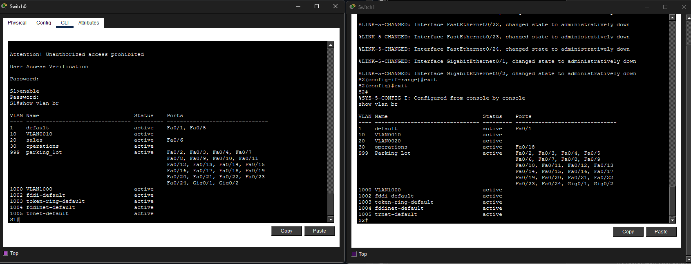
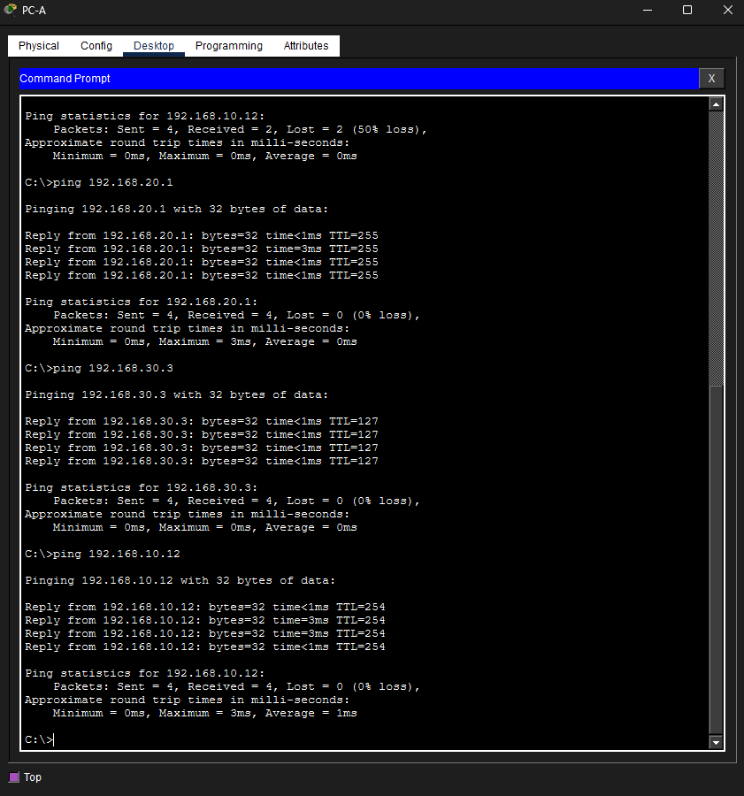

#Лабораторная работа - Внедрение маршрутизации между виртуальными локальными сетями 

#Часть 1. Создание сети и настройка основных параметров устройства

№№ Шаг 1. Создайте сеть согласно топологии.


##Шаг 1. Создайте сеть согласно топологии.

a.	Подключитесь к маршрутизатору с помощью консоли и активируйте привилегированный режим EXEC.
Откройте окно конфигурации
b.	Войдите в режим конфигурации.
c.	Назначьте маршрутизатору имя устройства.
d.	Отключите поиск DNS, чтобы предотвратить попытки маршрутизатора неверно преобразовывать введенные команды таким образом, как будто они являются именами узлов.
e.	Назначьте class в качестве зашифрованного пароля привилегированного режима EXEC.
f.	Назначьте cisco в качестве пароля консоли и включите вход в систему по паролю.
g.	Установите cisco в качестве пароля виртуального терминала и активируйте вход.
h.	Зашифруйте открытые пароли.
i.	Создайте баннер с предупреждением о запрете несанкционированного доступа к устройству.
j.	Сохраните текущую конфигурацию в файл загрузочной конфигурации.
k.	Настройте на маршрутизаторе время.


```
Router>en
Router#conf t
Router(config)#hostname R1
R1(config)#no ip domain-loo
R1(config)#no ip domain-lookup 
R1(config)#enable secret class
R1(config)#line cons 0
R1(config-line)#password cisco
R1(config-line)#login
R1(config-line)#exit
R1(config)#line vty 0 4
R1(config-line)#password cisco
R1(config-line)#login
R1(config-line)#exit
R1(config)#service password-en
R1(config)#service password-encryption 
R1(config)#banner motd #Attention! Unauthorized access prohibited! #
R1(config)#
R1#copy run
R1#copy running-config start
R1#copy running-config startup-config 
Destination filename [startup-config]? 
Building configuration...
[OK]
R1#clock ?
  set  Set the time and date
R1#clock set 16:24:00 
R1#clock set 16:24:00 ?
  <1-31>  Day of the month
  MONTH   Month of the year
R1#clock set 16:24:00 Jun 21 2026
R1#show clo
R1#show clock 
16:24:6.963 UTC Sun Jun 21 2026
```
##Шаг 3. Настройте базовые параметры каждого коммутатора.

a.	Присвойте коммутатору имя устройства.
b.	Отключите поиск DNS, чтобы предотвратить попытки маршрутизатора неверно преобразовывать введенные команды таким образом, как будто они являются именами узлов.
c.	Назначьте class в качестве зашифрованного пароля привилегированного режима EXEC.
d.	Назначьте cisco в качестве пароля консоли и включите вход в систему по паролю.
e.	Установите cisco в качестве пароля виртуального терминала и активируйте вход.
f.	Зашифруйте открытые пароли.
g.	Создайте баннер с предупреждением о запрете несанкционированного доступа к устройству.
h.	Настройте на коммутаторах время.
i.	Сохранение текущей конфигурации в качестве начальной.

###S1
```
Switch>enable
Switch#conf t
Enter configuration commands, one per line.  End with CNTL/Z.
Switch(config)#hostname S1
S1(config)#no ip domain-lo
S1(config)#no ip domain-lookup 
S1(config)#enable secret class
S1(config)#line cons 0
S1(config-line)#password cisco
S1(config-line)#login
S1(config-line)#exit
S1(config)#line vty 0 4
S1(config-line)#password cisco
S1(config-line)#login
S1(config-line)#exit
S1(config)#service password-encry
S1(config)#service password-encryption 
S1(config)#banne motd #Attention! Unauthorized access prohibited #
S1(config)#exit
S1#
%SYS-5-CONFIG_I: Configured from console by console
S1#clock set 16:35:00 Jun 21 2026
S1#copy runni
S1#copy running-config star
S1#copy running-config startup-config 
Destination filename [startup-config]? 
Building configuration...
[OK]
S1#
```
###S2

```
Switch>enable
Switch#conf t
Enter configuration commands, one per line.  End with CNTL/Z.
Switch(config)#hostname S2
S2(config)#enable secret class
S2(config)#no ip domain-loo
S2(config)#no ip domain-lookup 
S2(config)#line cons 0
S2(config-line)#password cisco
S2(config-line)#login
S2(config-line)#exit
S2(config)#line vty 0 4
S2(config-line)#password cisco
S2(config-line)#login
S2(config-line)#exit
S2(config)#service password-enc
S2(config)#service password-encryption 
S2(config)#banner motd # Attention! Unauthorized access prohibited! #
S2(config)#end
S2#
%SYS-5-CONFIG_I: Configured from console by console

S2#clock set 16:41:00 jun 21 2026
S2#copy run
S2#copy running-config sta
S2#copy running-config startup-config 
Destination filename [startup-config]? 
Building configuration...
[OK]
```
##Шаг 4. Настройте узлы ПК.


#Часть 2. Создание сетей VLAN и назначение портов коммутатора

##Шаг 1. Создайте сети VLAN на коммутаторах.
a.	Создайте и назовите необходимые VLAN на каждом коммутаторе из таблицы выше.
Откройте окно конфигурации
b.	Настройте интерфейс управления и шлюз по умолчанию на каждом коммутаторе, используя информацию об IP-адресе в таблице адресации. 
c.	Назначьте все неиспользуемые порты коммутатора VLAN Parking_Lot, настройте их для статического режима доступа и административно деактивируйте их.
Примечание. Команда interface range полезна для выполнения этой задачи с минимальным количеством команд.
##
S1

###a.
```
S1(config)#vlan 10
S1(config-vlan)#exit
S1(config)#vlan 20
S1(config-vlan)#name sales
S1(config-vlan)#exit
S1(config)#vlan 30
S1(config-vlan)#name operations
S1(config-vlan)#exit
S1(config)#vlan 999
S1(config-vlan)#name parking_lot
S1(config-vlan)#exit
S1(config)#vlan 1000
S1(config-vlan)#exit
S1(config)#int v  10
S1(config-if)#
%LINK-5-CHANGED: Interface Vlan10, changed state to up
```
###b.
```
S1(config-if)#int v  10
S1(config-if)#ip add 192.168.10.11 255.255.255.0
S1(config-if)#no shut
S1(config)#ip default-gateway 192.168.10.1
```
###c.
```
S1(config)#int r f0/2-4, f0/7-24, g0/1-2
S1(config-if-range)#sw m a
S1(config-if-range)#sw a v 999
S1(config-if-range)#shut
%LINK-5-CHANGED: Interface FastEthernet0/2, changed state to administratively down
%LINK-5-CHANGED: Interface FastEthernet0/3, changed state to administratively down
%LINK-5-CHANGED: Interface FastEthernet0/4, changed state to administratively down
%LINK-5-CHANGED: Interface FastEthernet0/7, changed state to administratively down
%LINK-5-CHANGED: Interface FastEthernet0/8, changed state to administratively down
%LINK-5-CHANGED: Interface FastEthernet0/9, changed state to administratively down
%LINK-5-CHANGED: Interface FastEthernet0/10, changed state to administratively down
%LINK-5-CHANGED: Interface FastEthernet0/11, changed state to administratively down
%LINK-5-CHANGED: Interface FastEthernet0/12, changed state to administratively down
%LINK-5-CHANGED: Interface FastEthernet0/13, changed state to administratively down
LINK-5-CHANGED: Interface FastEthernet0/14, changed state to administratively down
%LINK-5-CHANGED: Interface FastEthernet0/15, changed state to administratively down
%LINK-5-CHANGED: Interface FastEthernet0/16, changed state to administratively down
%LINK-5-CHANGED: Interface FastEthernet0/17, changed state to administratively down
%LINK-5-CHANGED: Interface FastEthernet0/18, changed state to administratively down
%LINK-5-CHANGED: Interface FastEthernet0/19, changed state to administratively down
%LINK-5-CHANGED: Interface FastEthernet0/20, changed state to administratively down
%LINK-5-CHANGED: Interface FastEthernet0/21, changed state to administratively down
%LINK-5-CHANGED: Interface FastEthernet0/22, changed state to administratively down
%LINK-5-CHANGED: Interface FastEthernet0/23, changed state to administratively down
%LINK-5-CHANGED: Interface FastEthernet0/24, changed state to administratively down
%LINK-5-CHANGED: Interface GigabitEthernet0/1, changed state to administratively down

```

##S2

a.
```
S2>enable
Password: 
S2#conf t
Enter configuration commands, one per line.  End with CNTL/Z.
S2(config)#vlan 10
S2(config-vlan)#^Z
S2#
%SYS-5-CONFIG_I: Configured from console by console

S2#
S2#conf t
Enter configuration commands, one per line.  End with CNTL/Z.
S2(config)#vlan 20
S2(config-vlan)#vlan 30
S2(config-vlan)#name operations
S2(config-vlan)#vlan 999
S2(config-vlan)#name Parking_Lot
S2(config-vlan)#vlan 1000
S2(config-vlan)#do sh v
% Ambiguous command: "sh v"
S2(config-vlan)#exit
```
b.
```
S2(config)#int v 10
S2(config-if)#
%LINK-5-CHANGED: Interface Vlan10, changed state to up

S2(config-if)#ip address 192.168.10.12 255.255.255.0
S2(config-if)#no shut
S2(config-if)#exit
S2(config)#ip deaf
S2(config)#ip defau
S2(config)#ip default-gateway 192.168.10.1
S2(config)#exit
```
c.
```
S2(config)#int range f0/2-17, f0/19-24, g0/1-2
S2(config-if-range)#switch
S2(config-if-range)#switchport mode access
S2(config-if-range)#sw access vlan 999
S2(config-if-range)#shut
```
## Шаг 2. Назначьте сети VLAN соответствующим интерфейсам коммутатора.
a.	Назначьте используемые порты соответствующей VLAN (указанной в таблице VLAN выше) и настройте их для режима статического доступа.
b.	Убедитесь, что VLAN назначены на правильные интерфейсы.

a.
```
S2(config)#int f0/18
S2(config-if)#sw mode access
S2(config-if)#sw a v 30
S2(config-if)#exit

S1(config)#int fastEthernet 0/6
S1(config-if)#switch
S1(config-if)#switchport mod
S1(config-if)#switchport mode acc
S1(config-if)#switchport mode access 
S1(config-if)#sw access vl 20
```


b.

#Часть 3. Конфигурация магистрального канала стандарта 802.1Q между коммутаторами

##Шаг 1. Вручную настройте магистральный интерфейс F0/1 на коммутаторах S1 и S2.
a.	Настройка статического транкинга на интерфейсе F0/1 для обоих коммутаторов.
Откройте окно конфигурации
b.	Установите native VLAN 1000 на обоих коммутаторах.
c.	Укажите, что VLAN 10, 20, 30 и 1000 могут проходить по транку.
d.	Проверьте транки, native VLAN и разрешенные VLAN через транк.

###S1
```
S1(config)#int f0/1
S1(config-if)#switchport mode trunk
S1(config-if)#
S1(config-if)#swicthport trunk native vlan 1000
S1(config)#int f0/1
S1(config-if)#sw tr native vlan 1000
S1(config-if)#switchport trunk allowe
S1(config-if)#switchport trunk
S1(config-if)#switchport trunk all
S1(config-if)#switchport trunk allowed vlan 10,20,30,1000
S1(config-if)#exit
S1(config)#do show int trunk
Port        Mode         Encapsulation  Status        Native vlan
Fa0/1       on           802.1q         trunking      1000

Port        Vlans allowed on trunk
Fa0/1       10,20,30,1000

Port        Vlans allowed and active in management domain
Fa0/1       10,20,30,1000

Port        Vlans in spanning tree forwarding state and not pruned
Fa0/1       10,20,30,1000
```
S2

```
S2(config)#int f0/1
S2(config-if)#sw m tr
S2(config-if)#sw tr native vlan 1000
S2(config-if)#%SPANTREE-2-UNBLOCK_CONSIST_PORT: Unblocking FastEthernet0/1 on VLAN1000. Port consistency restored.
S2(config-if)#switchport trunk allowed vlan 10,20,30,1000
S2(config-if)#exit
S2(config)#
S2(config)#do show int trunk
Port        Mode         Encapsulation  Status        Native vlan
Fa0/1       on           802.1q         trunking      1000

Port        Vlans allowed on trunk
Fa0/1       10,20,30,1000

Port        Vlans allowed and active in management domain
Fa0/1       10,20,30,1000

Port        Vlans in spanning tree forwarding state and not pruned
Fa0/1       10,20,30,1000

S2#show interface f0/1 sw
Trunking Native Mode VLAN: 1000 (VLAN1000)
```

##SШаг 2. Вручную настройте магистральный интерфейс F0/5 на коммутаторе S1.
a.	Настройте интерфейс S1 F0/5 с теми же параметрами транка, что и F0/1. Это транк до маршрутизатора.
b.	Сохраните текущую конфигурацию в файл загрузочной конфигурации.
c.	Проверка транкинга.
Вопрос:
Что произойдет, если G0/0/1 на R1 будет отключен?
###a.
```
S1#conf t
Enter configuration commands, one per line.  End with CNTL/Z.
S1(config)#int f0/5
S1(config-if)#switchport mode trunk
S1(config-if)#swicthport trunk native vlan 1000
                 ^
% Invalid input detected at '^' marker.
	
S1(config-if)#switchport trunk native vlan 1000
S1(config-if)#switchport trunk allowed vlan 10,20,30,1000
```

###b.
```
S1#copy run
S1#copy running-config st
S1#copy running-config startup-config
```
##c.
При проверке транков (show interface trunk) с выключенным портом g0/0/1 не отображается в таблице транков порт f0/5, так как маоршрутизатор не принимает и не передаёт трафик.

№Часть 4. Настройка маршрутизации между сетями VLAN
№№Шаг 1. Настройте маршрутизатор.
Откройте окно конфигурации
a.	При необходимости активируйте интерфейс G0/0/1 на маршрутизаторе.
b.	Настройте подинтерфейсы для каждой VLAN, как указано в таблице IP-адресации. Все подинтерфейсы используют инкапсуляцию 802.1Q. Убедитесь, что подинтерфейсу для native VLAN не назначен IP-адрес. Включите описание для каждого подинтерфейса.
c.	Убедитесь, что вспомогательные интерфейсы работают


a.
```
R1(config)#interface gigabitEthernet 0/0/1
R1(config-if)#no shut
```
b.
```
R1(config)#interface g0/0/1.10
R1(config-subif)#
%LINK-3-UPDOWN: Interface GigabitEthernet0/0/1.10, changed state to down
R1(config-subif)#descryption
R1(config-subif)#descrip
R1(config-subif)#description management VLAN
R1(config-subif)#encapsul
R1(config-subif)#encapsulation dot1q 10
R1(config-subif)#ip address 192.168.10.1 255.255.255.0
R1(config-subif)#exit
R1(config)#interface g0/0/1.20
R1(config-subif)#
R1(config-subif)#descript
R1(config-subif)#description sales
R1(config-subif)#description sales VLAN
R1(config-subif)#encapsulatio
R1(config-subif)#encapsulation dot1Q 20
R1(config-subif)#ip address 192.168.20.1 255.255.255.0
R1(config-subif)#interface g0/0/1.30
R1(config-subif)#
R1(config-subif)#descrip
R1(config-subif)#description operations VLAN
R1(config-subif)#encapsulat
R1(config-subif)#encapsulation dot1Q 30
R1(config-subif)#ip address 192.168.30.1 255.255.255.0
R1(config-subif)#exit
R1(config)#interface g0/0/1.1000
R1(config-subif)#
R1(config-subif)#descripti
R1(config-subif)#description Native VLAN
R1(config-subif)#encaps
R1(config-subif)#encapsulation dot1Q 1000 native
R1(config-subif)#end
```
c.
```
R1#show ip interface brief
Interface              IP-Address      OK? Method Status                Protocol 
GigabitEthernet0/0/0   unassigned      YES unset  administratively down down 
GigabitEthernet0/0/1   unassigned      YES unset  up                    up 
GigabitEthernet0/0/1.10192.168.10.1    YES manual up                    up 
GigabitEthernet0/0/1.20192.168.20.1    YES manual up                    up 
GigabitEthernet0/0/1.30192.168.30.1    YES manual up                    up 
GigabitEthernet0/0/1.1000unassigned      YES unset  up                    up 
Vlan1                  unassigned      YES unset  administratively down down
R1#
```
# RЧасть 5. Проверьте, работает ли маршрутизация между VLAN
##Шаг 1. Выполните следующие тесты с PC-A. Все должно быть успешно.
Примечание. Возможно, вам придется отключить брандмауэр ПК для работы ping
a.	Отправьте эхо-запрос с PC-A на шлюз по умолчанию.
b.	Отправьте эхо-запрос с PC-A на PC-B.
c.	Отправьте команду ping с компьютера PC-A на коммутатор S2.



## Шаг 2. Пройдите следующий тест с PC-B

В окне командной строки на PC-B выполните команду tracert на адрес PC-A.
Вопрос:
Какие промежуточные IP-адреса отображаются в результатах?
```
C:\>tracert 192.168.20.3

Tracing route to 192.168.20.3 over a maximum of 30 hops: 

  1   0 ms      0 ms      2 ms      192.168.30.1
  2   0 ms      0 ms      0 ms      192.168.20.3
```
Отображается подинтерфейся маршрутизатора.

