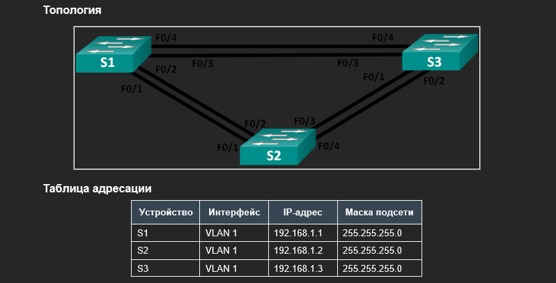
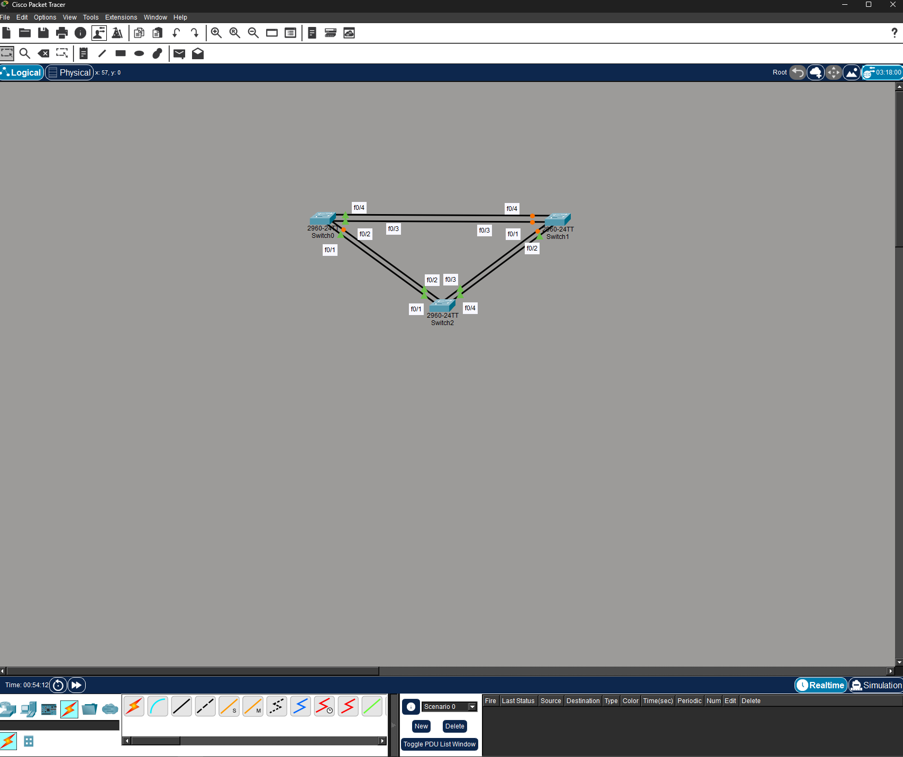
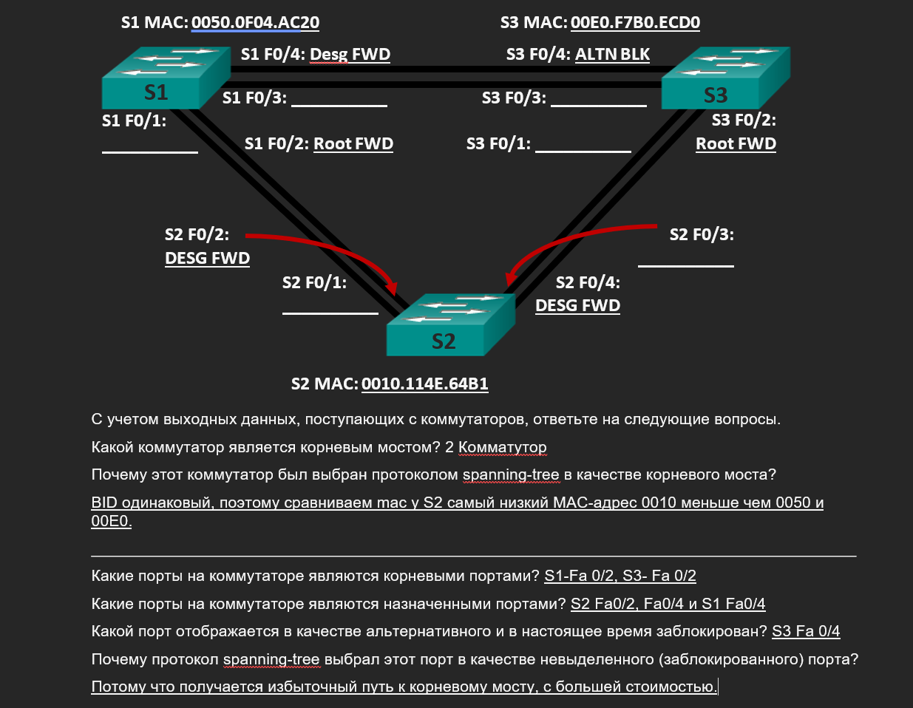

# Лабораторная работа. Развертывание коммутируемой сети с резервными каналами
Топология


№ Часть 1:	Создание сети и настройка основных параметров устройства
№№ Шаг 1:	Создайте сеть согласно топологии.



##Шаг 2:	Выполните инициализацию и перезагрузку коммутаторов.

```
Switch#eras
Switch#erase start
Switch#erase startup-config 
Erasing the nvram filesystem will remove all configuration files! Continue? [confirm]
[OK]
Erase of nvram: complete
%SYS-7-NV_BLOCK_INIT: Initialized the geometry of nvram
Switch#reload
```
##Шаг 3:	Настройте базовые параметры каждого коммутатора.

a.	Отключите поиск DNS.
b.	Присвойте имена устройствам в соответствии с топологией.
c.	Назначьте class в качестве зашифрованного пароля доступа к привилегированному режиму.
d.	Назначьте cisco в качестве паролей консоли и VTY и активируйте вход для консоли и VTY каналов.
e.	Настройте logging synchronous для консольного канала.
f.	Настройте баннерное сообщение дня (MOTD) для предупреждения пользователей о запрете несанкционированного доступа.
g.	Задайте IP-адрес, указанный в таблице адресации для VLAN 1 на всех коммутаторах.
h.	Скопируйте текущую конфигурацию в файл загрузочной конфигурации.

###S1
```
Switch>enable
Switch#no ip domai
Switch#conf t
Switch(config)#no ip domain-lookup
Switch(config)#hostname S1
S1(config)#enable secret class
S1(config)#line console 0
S1(config-line)#password cisco
S1(config-line)#login
S1(config-line)#exit
S1(config)#line vty 0 15
S1(config-line)#password cisco
S1(config-line)#login
S1(config-line)#logging synchronous
S1(config-line)#banner motd
S1(config-line)#banner motd # Unauthorized access denied #
S1(config)#interf 
S1(config)#interface 
S1(config)#interface vlan 1
S1(config-if)#ip address 192.168.1.1 255.255.255.0
S1(config-if)#end
S1#copy running-config startup-config 
Destination filename [startup-config]? 
Building configuration...
[OK]
```
###S2

```
Switch(config)#hostname S2
S2(config)#no ip domain-look
S2(config)#no ip domain-lookup 
S2(config)#enable secret class
S2(config)#line console 0
S2(config-line)#password cisco
S2(config-line)#login
S2(config-line)#exit
S2(config)#line vty 0 15
S2(config-line)#pass
S2(config-line)#password cisco
S2(config-line)#login
S2(config-line)#logging synch
S2(config-line)#logging synchronous 
S2(config-line)#banner motd # Unauthorized access denied #
S2(config)#interface vlan 1
S2(config-if)#ip address 192.168.1.2 255.255.255.0
S2#copy running-config startup-config 
Destination filename [startup-config]? 
Building configuration...
[OK]
```
###S3
```

Switch(config)#hostname S3
S3(config)#no ip domain-lookup
S3(config)#enable secret class
S3(config)#line console 0
S3(config-line)#password cisco
S3(config-line)#login
S3(config-line)#exit
S3(config)#line vty 0 15
S3(config-line)#password cisco
S3(config-line)#login
S3(config-line)#logging sync
S3(config-line)#logging synchronous 
S3(config-line)#bannerbanner motd # Unauthorized access denied #
                ^
% Invalid input detected at '^' marker.
	
S3(config-line)#banner motd # Unauthorized access denied #
S3(config)#interface vlan 1
S3(config-if)#ip address 192.168.1.3 255.255.255.0
S3(config-if)#exit
S3(config)#exit
S3#
S3#copy running-conf
S3#copy running-config start
S3#copy running-config startup-config 
Destination filename [startup-config]? 
Building configuration...
[OK]
```
##Шаг 4:	Проверьте связь.
Включаем порты на каждом коммутаторе командой interface range fastethernet 0/1 - 4
Проверьте способность компьютеров обмениваться эхо-запросами.
Успешно ли выполняется эхо-запрос от коммутатора S1 на коммутатор S2?	Успешно
Успешно ли выполняется эхо-запрос от коммутатора S1 на коммутатор S3?	Успешно
Успешно ли выполняется эхо-запрос от коммутатора S2 на коммутатор S3?	Успешно
Выполняйте отладку до тех пор, пока ответы на все вопросы не будут положительными.
S1
```

S1#ping 192.168.1.2

Type escape sequence to abort.
Sending 5, 100-byte ICMP Echos to 192.168.1.2, timeout is 2 seconds:
!!!!!
Success rate is 100 percent (5/5), round-trip min/avg/max = 0/1/6 ms
S1#ping 192.168.1.3

Type escape sequence to abort.
Sending 5, 100-byte ICMP Echos to 192.168.1.3, timeout is 2 seconds:
..!!!
Success rate is 60 percent (3/5), round-trip min/avg/max = 0/0/0 ms
```
S2
```
S2#ping 192.168.1.3

Type escape sequence to abort.
Sending 5, 100-byte ICMP Echos to 192.168.1.3, timeout is 2 seconds:
..!!!
Success rate is 60 percent (3/5), round-trip min/avg/max = 0/1/4 ms
```

#Часть 2:	Определение корневого моста
##Шаг 1:	Отключите все порты на коммутаторах.
```
S1(config)#interface range fast
S1(config)#interface range fastEthernet 0/1 - 24
S1(config-if-range)#shutdown
S2(config)#interface range fastEthernet 0/1 - 24
S2(config-if-range)#shut
S3(config)#interface range fastEthernet 0/1 - 24
S3(config-if-range)#shut
```
##Шаг 2:	Настройте подключенные порты в качестве транковых.
```
S1(config)#interface range fastEthernet 0/1 - 4
S1(config-if-range)#switchport mode trunk
S2(config)#interface range fastEthernet 0/1 - 4
S2(config-if-range)#switchpor
S2(config-if-range)#switchport mode trunk
S3(config)#interface range fastEthernet 0/1 - 4
S3(config-if-range)#switchp
S3(config-if-range)#switchport mode trunk
```
##Шаг 3:	Включите порты F0/2 и F0/4 на всех коммутаторах.
```
S1(config)#interface fastEthernet 0/2
S1(config-if)#no shut
S1(config-if)#interface fastEthernet 0/4
S1(config-if)#no shut

S2(config)#interface fastEthernet 0/2
S2(config-if)#no shut
S2(config-if)#interface fastEthernet 0/4
S2(config-if)#no shut

S3(config)#interface fastEthernet 0/2
S3(config-if)#no shut
S3(config-if)#interface fastEthernet 0/4
S3(config-if)#no shut
```
##Шаг 4:	Отобразите данные протокола spanning-tree.
S1
```
S1#show spanning-tree 
VLAN0001
  Spanning tree enabled protocol ieee
  Root ID    Priority    32769
             Address     0010.114E.64B1
             Cost        19
             Port        2(FastEthernet0/2)
             Hello Time  2 sec  Max Age 20 sec  Forward Delay 15 sec

  Bridge ID  Priority    32769  (priority 32768 sys-id-ext 1)
             Address     0050.0F04.AC20
             Hello Time  2 sec  Max Age 20 sec  Forward Delay 15 sec
             Aging Time  20

Interface        Role Sts Cost      Prio.Nbr Type
---------------- ---- --- --------- -------- --------------------------------
Fa0/4            Desg FWD 19        128.4    P2p
Fa0/2            Root FWD 19        128.2    P2p
```
S2
```

S2#show spanning-tree 
VLAN0001
  Spanning tree enabled protocol ieee
  Root ID    Priority    32769
             Address     0010.114E.64B1
             This bridge is the root
             Hello Time  2 sec  Max Age 20 sec  Forward Delay 15 sec

  Bridge ID  Priority    32769  (priority 32768 sys-id-ext 1)
             Address     0010.114E.64B1
             Hello Time  2 sec  Max Age 20 sec  Forward Delay 15 sec
             Aging Time  20

Interface        Role Sts Cost      Prio.Nbr Type
---------------- ---- --- --------- -------- --------------------------------
Fa0/2            Desg FWD 19        128.2    P2p
Fa0/4            Desg FWD 19        128.4    P2p
```
S3
```
S3#show spanning-tree 
VLAN0001
  Spanning tree enabled protocol ieee
  Root ID    Priority    32769
             Address     0010.114E.64B1
             Cost        19
             Port        2(FastEthernet0/2)
             Hello Time  2 sec  Max Age 20 sec  Forward Delay 15 sec

  Bridge ID  Priority    32769  (priority 32768 sys-id-ext 1)
             Address     00E0.F7B0.ECD0
             Hello Time  2 sec  Max Age 20 sec  Forward Delay 15 sec
             Aging Time  20

Interface        Role Sts Cost      Prio.Nbr Type
---------------- ---- --- --------- -------- --------------------------------
Fa0/2            Root FWD 19        128.2    P2p
Fa0/4            Altn BLK 19        128.4    P2p
```


